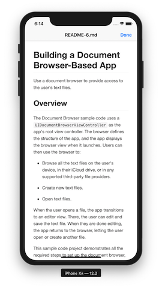

# Mark Viewer

  

**Mark Viewer** is a [document based app](https://developer.apple.com/documentation/uikit/view_controllers/adding_a_document_browser_to_your_app), its main purpose is to view [Markdown](https://en.wikipedia.org/wiki/Markdown) files.

### Requirements

- Xcode 10
- Swift 5
- iOS 11
- Cocoapods 1.6.1

### How to Build

1. Open your terminal and go to the directory.
2. Execute `pod install` to install pods.
3. Open `Mark Viewer.xcworkspace`.
4. Change the `Bundle Identifier` and `Signing` settings.
5. Run the project.

### Todo

Below are some items in my todo list, **contributions are more than welcome!**

- [ ] Beautiful app icons and splash image.
- [ ] Preview and Thumbnail extensions.
- [ ] Ability to switch themes.
- [ ] Edit markdown files?